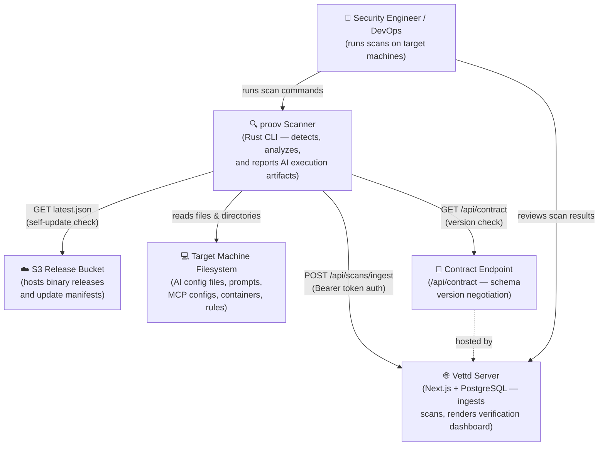

# C4 Level 1 — System Context

Shows how the **proov** scanner relates to external actors and systems.

## Key Relationships

| From  | To           | Protocol           | Purpose                                 |
| ----- | ------------ | ------------------ | --------------------------------------- |
| User  | proov        | CLI (stdin/stdout) | Run scans, manage rules, configure auth |
| proov | Filesystem   | OS read            | Discover and analyze AI artifacts       |
| proov | Vettd Server | HTTPS POST         | Submit scan contract payloads           |
| proov | Vettd Server | HTTPS GET          | Contract version negotiation            |
| proov | S3 Bucket    | HTTPS GET          | Check for binary updates                |
| User  | Vettd Server | Browser            | Review verification dashboard           |
