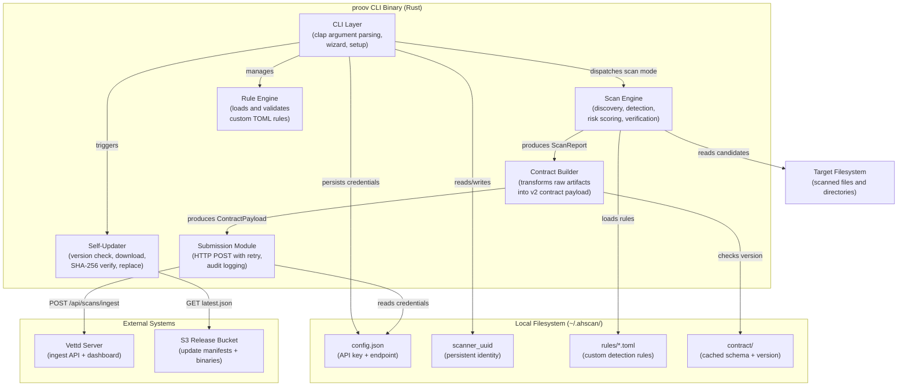

# C4 Level 2 — Container Diagram

Shows the major runtime containers and data stores within the **proov** system boundary.

## Container Responsibilities

| Container         | Technology           | Purpose                                                           |
| ----------------- | -------------------- | ----------------------------------------------------------------- |
| CLI Layer         | clap + crossterm     | Parse commands, interactive wizard, setup flow                    |
| Scan Engine       | walkdir + detectors  | Discover filesystem candidates, run detectors, score risk, verify |
| Contract Builder  | serde + custom logic | Transform `ScanReport` into versioned `ContractPayload`           |
| Submission Module | ureq (HTTP)          | Auth config I/O, HTTP dispatch with retry, audit logging          |
| Self-Updater      | ureq + flate2/tar    | Check S3 manifest, download, verify SHA-256, swap binary          |
| Rule Engine       | toml + validation    | Load, validate, install custom `.toml` detection rules            |
| Local Storage     | Filesystem           | Persist identity, auth, rules, and contract cache                 |
