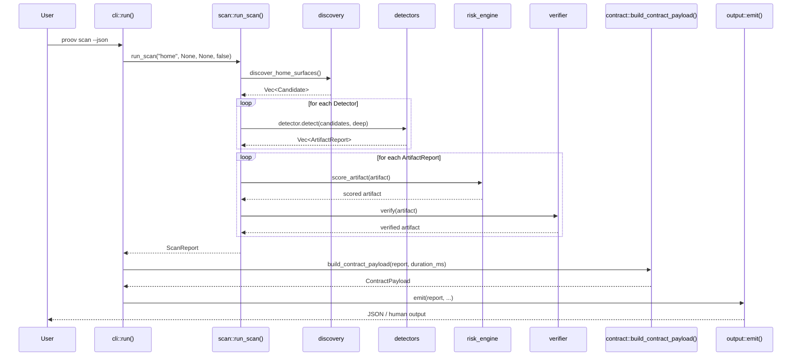
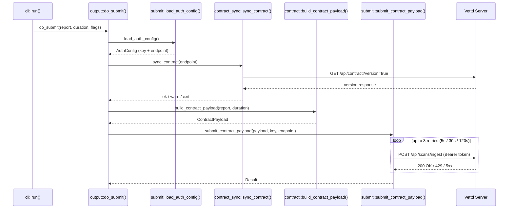
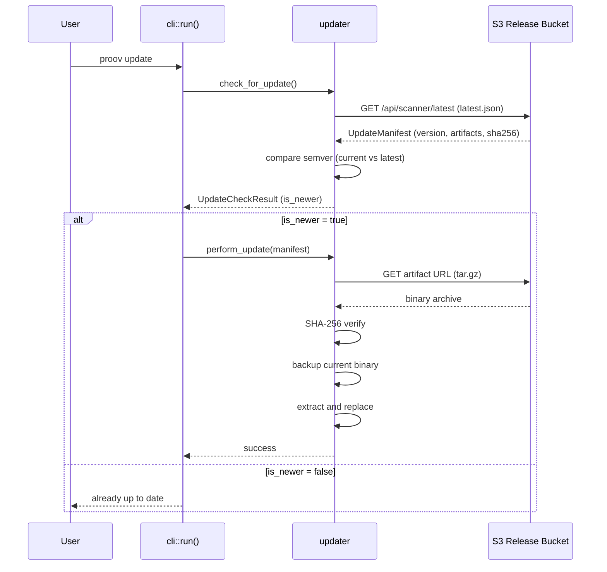
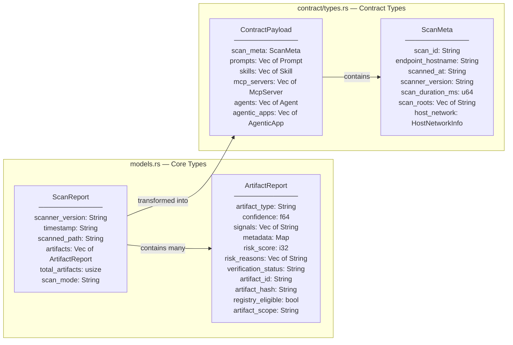
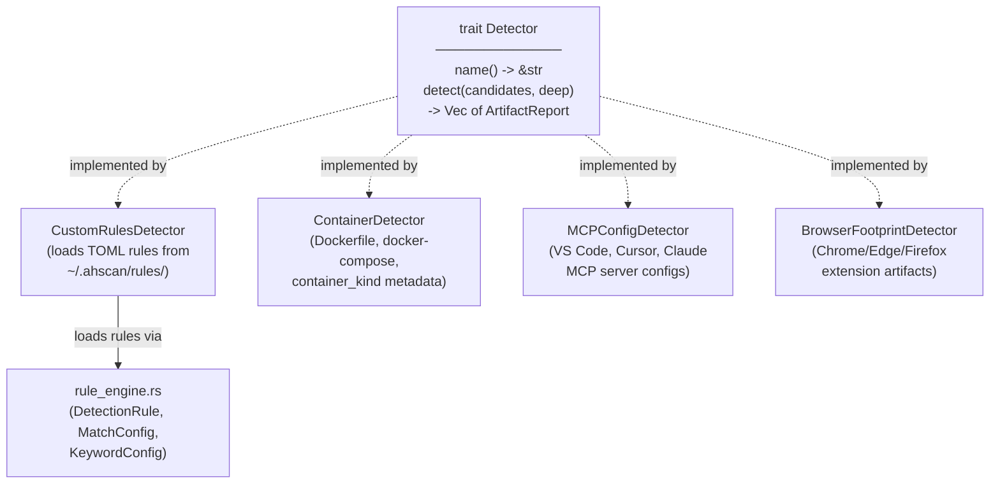
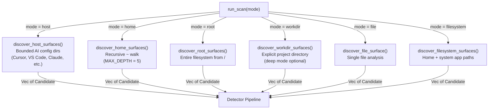

# C4 Level 4 — Code Diagrams

Zooms into key data flows and type relationships at the code level.

## Scan Pipeline Sequence

The core scan execution from CLI invocation through to output.

## Submission Flow Sequence

The HTTP submission path when `--submit` is used.

## Self-Update Flow Sequence

Binary update check, download, and replacement.

## Core Data Types

## Detector Trait and Implementations

## Discovery Modes

